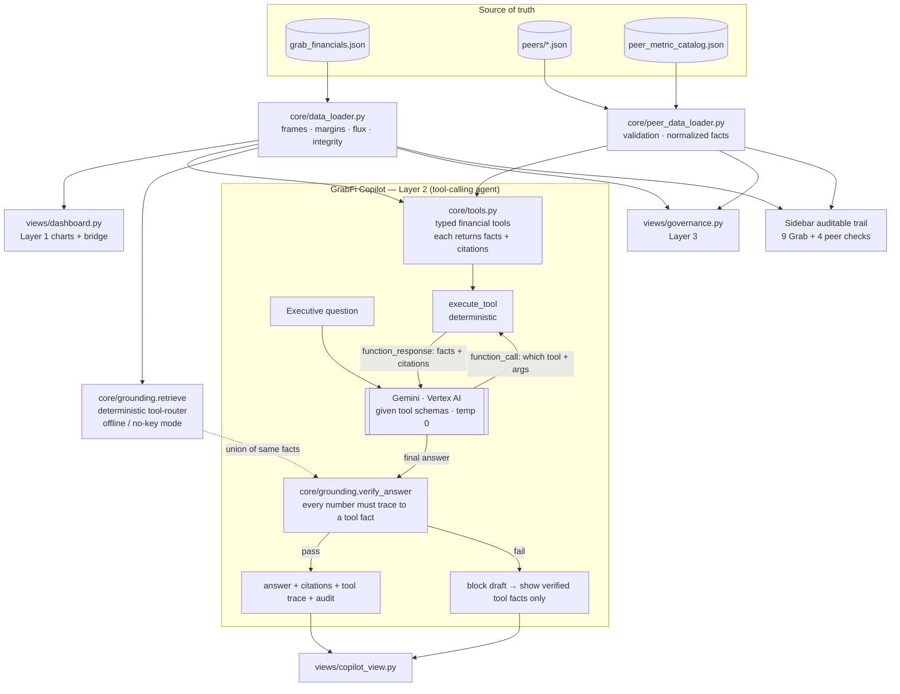

# GrabFi — Build Specification

**Case study:** *Analyst, Finance Solutions Excellence* — turn corporate financial performance data into a smart, automated insight tool.
**Subject company:** Grab Holdings Limited (NASDAQ: GRAB), FY2023–FY2025, with a common-metric benchmark layer for Uber, Lyft, DoorDash, and Sea.
**Deliverable:** A Streamlit app implementing three layers — (1) Core Finance & Flux Analysis, (2) a grounded **tool-calling GrabFi Copilot agent**, (3) Compliance & Scale.
**Spec status:** Implemented architecture and acceptance contract.

---

## 0. How to use this project

1. Work from this package directory; this `SPEC.md` is authoritative.
2. Run `pytest -q` and `python eval/run_eval.py` after data, tool, prompt, or UI changes.
3. Financial values shown in the UI must flow from the structured datasets; narrative documents may quote values only as documented examples.
4. Peer source coverage and extraction depth are distinct: `peer_source_inventory.json` records available disclosure, while `data/peers/*.json` contains the currently extracted common-metric layer.

> **Why this matters:** the central requirement of the case study (Layer 2) is "answer without hallucinating numbers." The whole architecture enforces that numbers come *only* from the dataset, are retrieved deterministically, and are verified after generation. Don't undermine it with a stray literal in a chart title.

---

## 1. Product overview

A Grab-focused financial intelligence app with official-IR benchmarks for Uber, Lyft, DoorDash, and Sea:

| Tab | Case-study layer | One-liner |
|---|---|---|
| **📊 Finance & Flux** | Layer 1 — "The What" | Visualise revenue, margins, segment EBITDA over 3 years; isolate the exact drivers of each change with an auditable trail. |
| **🤖 GrabFi Copilot** | Layer 2 — "The How" | Ask NL questions; answers are grounded in the filings and numerically verified before display. |
| **🛡️ Governance & Scale** | Layer 3 — "The So What" | Guardrails, access controls, and evaluation methodology for handling sensitive financial data at scale. |

Plus a persistent sidebar: linked Grab and peer provenance, a 13-check auditable-trail badge (9 Grab tie-outs + 4 peer dataset validations), year filter, and Copilot model selector.

---

## 2. The narrative the app must tell (so the build surfaces the right story)

Grab's FY2025 is a genuine inflection: **first full year of net profit**. The dashboard and the copilot's default views should make this story legible:

- **Headline:** Revenue $3,370M (+20% YoY); Adjusted EBITDA $500M (+60%); **net profit $200M** vs −$158M in FY2024 — the first profitable year. Operating profit turned positive ($65M vs −$168M).
- **Mobility = the profit engine.** Segment Adj EBITDA $690M at **8.7% of GMV** — high-margin, steady, funds everything else.
- **Deliveries = the operating-leverage + Advertising story.** Segment Adj EBITDA margin climbed **0.8% → 1.7% → 2.0% of GMV** across FY23–25; Advertising (~$216M annualised run-rate) is the margin lever.
- **Financial Services = the funded growth bet.** Loan book **+120% YoY to $1,180M**; still EBITDA-negative (−$110M) but the loss as % of revenue improved from **−96% → −32%**. This is a deliberate loss-leader being subsidised by the On-Demand core.
- **Regional corporate costs are the drag** (−$368M), the gap between Total Segment Adj EBITDA ($868M) and Group Adjusted EBITDA ($500M).
- **The bridge (FY24 → FY25 Adjusted EBITDA, +$187M):** Mobility +$121M, Deliveries +$91M, Financial Services −$5M, Others −$2M, Regional corp costs −$18M. (Ties exactly.)
- **Auditable-trail nuance to highlight:** Grab *recast* FY2023 Deliveries Segment Adj EBITDA from the originally-reported **$313M** down to **$81M** in the FY2024 release (regional-cost reallocation). The app uses the recast $81M for a like-for-like trend and flags the restatement — exactly the "clear, auditable trail back to source data" Layer 1 asks for.
- **Forward-view boundary:** management guidance remains stored as source metadata, but the current Copilot contract answers reported FY2023–FY2025 performance and refuses forecasts or unsupported periods.

---

## 3. Datasets and source precedence

Stored at `data/grab_financials.json` (included, validated). All values in **USD millions** unless noted; IFRS basis; figures from Grab's official 6-K earnings releases.

> **Cadence (demo vs production):** this demo uses **annual** figures (the audited public-filing basis). In production for the executive audience, I would build it at **quarterly and monthly** granularity using Grab's internal data — finer driver/seasonality analysis and timelier decisions. The period dimension is data-driven (`YEARS` is derived from the data), so a finer cadence is a data change, not a re-architecture, and "months → quarter → year" roll-ups become additional integrity tie-outs.

### 3.1 Group financials

| Metric | FY2023 | FY2024 | FY2025 |
|---|---:|---:|---:|
| Revenue | 2,359 | 2,797 | 3,370 |
| Cost of revenue | (1,499) | (1,623) | (1,914) |
| S&M expense | (293) | (324) | (367) |
| G&A expense | (550) | (512) | (459) |
| R&D expense | (421) | (410) | (428) |
| Net impairment (credit loss) | (72) | (95) | (140) |
| Operating profit/(loss) | (519) | (168) | 65 |
| Net finance income | 60 | 81 | 203 |
| **Profit/(loss) for year** | **(485)** | **(158)** | **200** |
| **Adjusted EBITDA** | **(22)** | **313** | **500** |
| Total Segment Adj EBITDA | 376 | 663 | 868 |
| Regional corporate costs | (398) | (350) | (368) |
| Share-based comp | (304) | (279) | (241) |
| D&A | (145) | (147) | (177) |
| Operating cash flow | 86 | 852 | 79 |
| Adjusted free cash flow | (234) | 162* | 290 |
| Capex | (140) | (149) | (188) |

### 3.2 Segment Adjusted EBITDA & revenue

| Segment | Basis | Metric | FY2023 | FY2024 | FY2025 |
|---|---|---|---:|---:|---:|
| Deliveries | GMV | Revenue | 1,310 | 1,493 | 1,800 |
|  |  | GMV | 10,365 | 11,723 | 14,236 |
|  |  | Seg Adj EBITDA | 81* | 196 | 287 |
| Mobility | GMV | Revenue | 871 | 1,047 | 1,219 |
|  |  | GMV | 5,420 | 6,640 | 7,901 |
|  |  | Seg Adj EBITDA | 466 | 569 | 690 |
| Financial Services | Revenue | Revenue | 177 | 253 | 347 |
|  |  | Seg Adj EBITDA | (170) | (105) | (110) |
|  |  | Loan portfolio | 326 | 536 | 1,180 |
| Others | Revenue | Revenue | 1 | 4 | 4 |
|  |  | Seg Adj EBITDA | (1) | 3 | 1 |

\* FY2023 Deliveries was recast from $313M to $81M. FY2024 Adjusted Free Cash Flow was recast from $136M to $162M after the FY2025 definition added proceeds from PP&E disposals.

### 3.3 Operating metrics

| Metric | FY2023 | FY2024 | FY2025 | Unit |
|---|---:|---:|---:|---|
| On-Demand GMV | 15,592 | 18,364 | 22,138 | USD M |
| Group MTUs | 35.5 | 41.3 | 47.2 | millions |
| On-Demand GMV/MTU | 506 | 494 | 513 | USD |
| Partner incentives | 682 | 755 | 1,002 | USD M |
| Consumer incentives | 907 | 1,088 | 1,268 | USD M |
| Loan portfolio | 326 | 536 | 1,180 | USD M |

### 3.4 Integrity invariants (must always hold — enforced by `consistency_report()`)

For every year: `Σ segment revenue = group revenue`; `Σ segment Adj EBITDA = Total Segment Adj EBITDA`; `Total Segment Adj EBITDA − Regional corporate costs = Group Adjusted EBITDA`. All 9 checks currently **PASS** (tolerance $1M for rounding).

### 3.5 Sources

- **FY2025** — Q4/FY2025 6-K (Exhibit 99.1), filed 2026-02-12. SEC EDGAR `0001855612`.
- **FY2024 & recast FY2023** — FY2024 6-K (Exhibit 99.1), filed 2025-02-20.
- **FY2023 (original)** — FY2023 6-K (Exhibit 99.1), filed 2024-02-22.

---

## 4. Tech stack

- **Python** 3.11+
- **Streamlit** ≥ 1.39 (chat: `st.chat_message`, `st.chat_input`, `st.write_stream`; layout: `st.tabs`, `st.metric`, `st.columns`)
- **pandas** for tidy frames / derived metrics
- **plotly** for charts (waterfall bridge needs `go.Waterfall`; interactive hover for the "auditable" drill-down)
- **google-genai** ≥ 1.0 — Vertex AI Gemini SDK for the copilot. Model default `gemini-3.5-flash` (requires `VERTEX_LOCATION=global`; swappable via `COPILOT_MODEL`); retain `gemini-2.5-flash` as a fallback in the sidebar.
- **python-dotenv** for local secrets
- Optional: **pytest** for the test suite (§11)

> **Cloud note:** Grab's production estate is **AWS**; the app is deployed there (ECS Fargate / App Runner / EKS). The copilot reaches its model as a managed endpoint behind a thin client layer in `core/copilot.py`, so the provider is configurable without touching the rest of the app (only typed numeric facts are sent in the request).

SDK call shape (Vertex AI, agentic tool-calling loop):
```python
from google import genai
from google.genai import types as gtypes
client = genai.Client(vertexai=True,
                      project=os.environ["VERTEX_PROJECT_ID"],
                      location=os.environ.get("VERTEX_LOCATION", "global"))
response = client.models.generate_content(
    model="gemini-3.5-flash", contents=messages,
    config=gtypes.GenerateContentConfig(
        system_instruction=SYSTEM_PROMPT, tools=gemini_tools, temperature=0.0),
)
# model emits function_call parts -> execute tools -> feed function_response back -> loop
```

---

## 5. Repository structure

```
grab-finance-copilot/
├── SPEC.md                     # this file
├── README.md                   # run/deploy instructions
├── requirements.txt            # dependencies
├── .streamlit/
│   └── config.toml             # Grab-green theme
├── app.py                      # entry: sidebar + 3 tabs
├── data/
│   ├── grab_financials.json    # Grab source of truth
│   ├── peer_metric_catalog.json# comparison rules
│   ├── peer_source_inventory.json # available vs extracted peer scope
│   └── peers/                  # one official-IR-backed JSON per peer
├── core/
│   ├── data_loader.py          # Grab frames, flux, integrity checks
│   ├── peer_data_loader.py     # peer validation + normalized adapter
│   ├── tools.py                # typed tools + JSON-Schema definitions
│   ├── grounding.py            # deterministic router + numeric verifier
│   └── copilot.py              # Gemini tool loop + grounding gate
├── views/
│   ├── dashboard.py            # Layer 1 UI
│   ├── copilot_view.py         # Layer 2 chat UI
│   └── governance.py           # Layer 3 visual + detailed controls
├── eval/
│   ├── golden_questions.yaml   # eval set (§9.4)
│   └── run_eval.py             # recall + grounding harness
└── tests/
    └── test_*.py               # runtime, data, UI, and drift tests
```

---

## 6. Architecture & data flow



**Key principle:** the agent is never trusted to *recall* a figure. The model's job is to *choose tools and phrase results*; each tool reads the dataset deterministically and returns facts with citations; a deterministic verifier blocks any number that can't be traced to a tool's output. That is what makes "no hallucinated numbers" a guarantee rather than a hope. Offline (no API key), `grounding.retrieve()` is the deterministic router that unions the same facts, so the app still answers.

---

## 7. Layer 1 — Finance & Flux (`views/dashboard.py`)

Build with `st.tabs` or vertical sections:

**7.1 KPI header** — `st.metric` cards (value + YoY delta): Revenue, Adjusted EBITDA, Net Profit/(Loss), On-Demand GMV, Group MTUs, Adj FCF. Use the FY selected in the sidebar (default FY2025), delta vs prior year.

**7.2 Revenue & profitability trend** — grouped/stacked plotly: Group revenue bars (FY23–25) with a Net Profit and an Adjusted EBITDA line overlaid (secondary axis). Annotate the FY2025 "first net profit" point.

**7.3 Segment mix** — (a) stacked bar of segment **revenue** by year; (b) stacked/grouped bar of segment **Adjusted EBITDA** by year showing Mobility carrying the group and Financial Services as the negative bar; (c) line chart of **Segment Adj EBITDA margin** (Deliveries & Mobility vs GMV; FinServ vs revenue) — sourced from `data_loader.segment_margins()`.

**7.4 Flux / bridge analysis (the core ask)** — a plotly **waterfall** (`go.Waterfall`) driven by `data_loader.flux_bridge(metric, start, end)`:
- Selector for metric (`revenue` | `adjusted_ebitda`) and the year pair (FY23→24, FY24→25).
- Bars: start total → each segment contribution (sorted by magnitude) → regional corp costs (for EBITDA) → end total.
- Each bar's hover shows the two underlying segment values and the delta — the **auditable drill-down**. Below the chart, a `st.dataframe` lists each driver with its $ contribution and source citation.
- Default view: Adjusted EBITDA FY24→FY25 (+$187M decomposition from §2).

**7.5 Auditable trail panel** — render `consistency_report()` as a checklist (✅/❌ per invariant) and a short note on the FY2023 Deliveries restatement ($313M → $81M). This is the literal "clear, auditable trail back to the source data" deliverable.

All numbers come from `data_loader`. No literals.

---

## 8. Layer 2 — GrabFi Copilot: a tool-calling agent (`views/copilot_view.py` + `core/tools.py`, `core/copilot.py`)

The copilot is an **LLM agent that calls typed financial tools** and is held to a deterministic grounding gate. This satisfies the case study's "LLM/Agentic framework" requirement *and* the "without hallucinating numbers" requirement — the agent's freedom is in *which tools to call and how to explain*, never in *what the numbers are*.

### 8.1 The agent loop (implemented in `core/copilot.py`)

```
question
  → Gemini (Vertex AI), given the tool schemas (core/tools.py) + agent system prompt, temp 0
  → model emits function_call part(s)     # the MODEL decides which tools, with what args
  → execute_tool() runs each tool deterministically → typed facts + citations
  → tool_result fed back into the conversation
  → loop (max 5 rounds) until the model returns a final text answer
  → verify_answer(): every number in the answer must trace to a fact a tool returned
        pass  → return answer + citations + tool-call trace + verification
        fail  → BLOCK the draft, return the verified tool facts instead
```

Already implemented: `core.copilot.ask(question, model, temperature) -> CopilotResponse{answer, retrieval, verification, mode, model, citations, tool_calls}` where `mode ∈ {"agent", "retrieval_only", "blocked", "refused"}`.

### 8.2 The tools (`core/tools.py`, built & tested — 9 typed tools)

Each tool is a deterministic function over `data_loader` that returns `Fact{value, label, unit, citation}`; `execute_tool(name, args)` dispatches and returns `(text_for_model, facts_for_verifier)`. The JSON-Schema tool defs use **enums** so the model can only pass valid segments/fields/years.

| Tool | Purpose |
|---|---|
| `get_group_financials(metrics[], years[])` | Group P&L lines, Adjusted EBITDA, cash flow. |
| `get_segment_financials(segment, fields[], years[])` | Revenue / GMV / Segment Adj EBITDA for one segment. |
| `get_segment_margins(segments[], years[])` | Segment Adj EBITDA margin (GMV- or revenue-based). |
| `get_operating_metrics(metrics[], years[])` | On-Demand GMV, MTUs, GMV/MTU, incentives, loan book. |
| `compute_flux_bridge(metric, start_year, end_year)` | Decompose YoY change in revenue / adjusted_ebitda into segment + corporate drivers. |
| `get_company_financials(company, metrics[], years[])` | Official-IR group financials for Grab and loaded peers. |
| `get_company_operating_metrics(company, metrics[], years[])` | Company-reported scale and operating metrics with original labels. |
| `get_company_segment_metrics(company, metrics[], years[])` | Loaded peer segment facts; currently Sea segment Adjusted EBITDA. |
| `compare_companies(companies[], metric, years[], comparison_mode)` | Guardrailed strict or directional peer comparison. |

### 8.3 Why deterministic tools (not free-form vector-RAG) — the design trade-off

The corpus is compact structured numeric evidence, not a free-form document pile. Therefore:
- **Tools are deterministic.** The agent *orchestrates*; the tools don't "search," they *return the exact figure*. This removes the retrieval-similarity hallucination surface that vector-RAG introduces, and makes answers reproducible (temp 0 + pinned model + pinned data ⇒ same answer).
- **The verifier is the backstop.** Even a perfectly-prompted agent can mis-state a number; the post-generation numeric gate (§8.5) catches it. This is the part most submissions won't have.
- **Trade-off acknowledged:** letting the model freely explore would be more "autonomous" but adds latency, cost, and nondeterminism for zero benefit at this corpus size. The chosen design is *agent interface + tool-calling, deterministic tools, verifier gate* — and it scales: add tools (more periods, peers, segment detail) without changing the contract.

### 8.4 UI (`views/copilot_view.py`)

- `st.chat_input` + `st.chat_message` thread; seed example chips: *"Why did Grab turn profitable in 2025?"*, *"Compare Mobility vs Deliveries margins"*, *"How fast is the lending book growing and what's it costing?"*, *"Bridge the EBITDA change from 2024 to 2025."*
- On each question call `core.copilot.ask(question, model=<sidebar choice>)`.
- **Render the transparency block under every answer** (this is what impresses reviewers):
  1. **Mode badge** — `agent` ✅ / `retrieval_only` ⚠️ (no key) / `blocked` 🛑 (grounding failed).
  2. **Tool-call trace** — `resp.tool_calls`: which tools the agent chose and with what args (shows the agent reasoning, not a black box).
  3. **Citations** — `resp.citations` (filings used).
  4. **Facts the tools returned** — `st.expander` listing `resp.retrieval.facts`.
  5. **Verification** — `resp.verification`: numbers checked + PASS/FAIL with any ungrounded values.
- If `mode == "retrieval_only"`, show an info banner: running without an API key, copilot returns verified facts directly.

### 8.5 The grounding gate (`core/grounding.verify_answer`, unchanged)

After the agent produces its final answer, every numeric token is extracted and checked against the union of facts the tools returned **and** their pairwise derivations (differences, sums, `(a−b)/|b|·100`, `a/b·100`) within tolerance (rel 1% / abs 0.6). Filing dates and supported year labels are excluded; Markdown list indices are stripped before checking rather than globally whitelisting small numbers. Any ungrounded number ⇒ the answer is **blocked** and the verified tool facts are shown instead.

> Tested: for the bridge question the agent calls `compute_flux_bridge`; a faithful answer ("…+187; Mobility +121, Deliveries +91, corp −18, FinServ −5, Others −2") **passes**; a fabricated "Mobility contributed 150" is **blocked**.

---

## 9. Layer 3 — Governance & Scale (`views/governance.py`)

Render as readable sections (this tab is largely the written deliverable; keep it concrete).

**9.1 Agent guardrails (defense in depth)**
- *Input:* scope-limit to Grab, Uber, Lyft, DoorDash, and Sea for FY2023–FY2025; refuse unsupported companies, periods, and forecasts before model execution.
- *Tool layer:* the agent can only call the **whitelisted, typed tools** in `core/tools.py`; enum-constrained arguments mean it cannot request invalid segments/years; tools are read-only and deterministic (no tool can mutate data or reach outside the dataset). Bounded agent loop (max 5 tool rounds) prevents runaway tool-calling.
- *Grounding:* the agent uses only tool outputs; `temperature=0`; numbers come from tools, never model memory.
- *Output:* the numeric verification gate (§8.5) blocks ungrounded generated numbers; citations, tool-call trace, and facts-used evidence are displayed. Retrieval-only mode returns deterministic facts without model generation.
- *Logging:* the demo retains the conversation and evidence in Streamlit session state. Durable user-attributed, append-only audit logging is a production control, not implemented in the demo.

**9.2 Access controls (production)**
- AuthN via corporate SSO/OIDC; AuthZ via role + data-classification tags (e.g. `public-filing` vs `pre-release MNPI`). The copilot must **physically partition** unreleased/material-non-public data — never load MNPI into a session for an unauthorised role. Row/period-level entitlements enforced at the retrieval layer, not the prompt.
- Secrets in a managed vault (not `.env` in prod); least-privilege API keys; per-user rate limits; PII/MNPI redaction before any model call; data residency honoured.
- Full audit log (who asked what, which facts, which model, verification result) with retention for compliance (SOX/insider-trading surveillance).

**9.3 Compliance posture**
- Treat as a **decision-support** tool, not a system of record; outputs carry "derived from public filings; verify against source" labelling.
- Model calls use an enterprise endpoint with the approved data-use policy. **Vertex AI (`global`) is used for this demo only**; in production the model provider is whatever Grab approves under its compliance policy (e.g. Amazon Bedrock or an internal LLM), with the required residency, data-use, and retention controls.
- Change management: dataset versioned; restatements (like the FY2023 Deliveries recast) tracked with effective dates; reproducibility (temp 0 + pinned model + pinned data = re-runnable answer).

**9.4 Evaluation methodology (`eval/`)**
- **Golden-question set** (`golden_questions.yaml`): 27 cases covering answerable retrieval, adversarial numbers, and deterministic refusal behavior.
- **Metrics:** (1) *Retrieval recall* — did `retrieve()` surface all facts needed? (2) *Grounding precision* — does `verify_answer()` pass on correct answers and **fail on injected hallucinations** (adversarial set with wrong numbers)? (3) *Refusal correctness* — out-of-scope questions get a refusal, not a fabrication. (4) *Citation coverage* — every figure cited.
- **Regression gate:** `run_eval.py` exits non-zero if recall < 100% on the golden set or the verifier passes any adversarial (hallucinated) answer. Wire into CI.

---

## 10. Implemented build sequence

1. **Scaffold** — `requirements.txt`, `.streamlit/config.toml` (Grab green theme), `app.py` with sidebar (provenance, integrity badge, year filter, model selector) + 3 empty tabs. Verify `streamlit run app.py` boots.
2. **Layer 1** — implement `views/dashboard.py` per §7 (KPIs → trends → segment mix → waterfall → audit panel). Verify every figure matches §3.
3. **Layer 2** — implement `views/copilot_view.py` per §8 against the existing `core.copilot.ask` (agentic tool-calling loop). Render the tool-call trace + verification panel. Test offline (retrieval-only) first, then with a key (agent mode).
4. **Layer 3** — implement `views/governance.py` per §9.
5. **Eval + tests** — `tests/test_core.py` (integrity + verifier), `eval/` harness + golden set; make the regression gate pass.
6. **Polish + README** — example questions, empty/error states, deploy notes (AWS: ECS Fargate / App Runner + Secrets Manager).

---

## 11. Acceptance criteria

- [ ] `python -m core.data_loader` → all 9 integrity checks PASS; flux EBITDA FY24→25 sums to +187.
- [ ] App boots; sidebar auditable-trail badge shows 13/13 green (9 Grab tie-outs + 4 peer validations).
- [ ] Layer 1: KPI/segment/margin figures exactly match §3; waterfall start+drivers = end for both metrics and both year-pairs.
- [ ] Layer 2: with no key → `retrieval_only` answers with citations; with key → `agent` answers that call tools (tool-call trace shown); an injected hallucination (e.g. a fabricated segment figure) is **blocked**.
- [ ] Every figure the copilot prints is traceable to a tool output (verification PASS); the tool-call trace is visible per answer.
- [ ] Out-of-scope question ("What's Grab's 2027 revenue?" / "Tell me about Gojek") → graceful refusal, no fabricated number.
- [ ] `eval/run_eval.py` exits 0; recall = 100% on golden set; 0 adversarial answers pass the verifier.
- [ ] No runtime financial value is hardcoded outside the structured datasets (grep and UI tests).

---

## 12. Reference implementation (already built & tested — included)

These are in the repo and pass their smoke tests; reuse as-is:

- **`core/data_loader.py`** — loads the JSON; `group_frame()`, `segment_frame(field)`, `segment_margins()`, `operating_metrics_frame()`, `yoy(df)`, `group_adj_ebitda_margin()`, `flux_bridge(metric, start, end) -> [FluxStep]`, `consistency_report() -> [(name, ok, detail)]`. Run `python -m core.data_loader` to see all checks pass.
- **`core/tools.py`** — 9 typed financial tools: five Grab analysis tools plus company financial, operating, peer-segment, and comparison tools. Each is deterministic and returns `Fact`s with citations; `TOOLS` contains enum-constrained JSON-Schema definitions converted to Gemini `FunctionDeclaration`s at call time.
- **`core/peer_data_loader.py`** — validates official IR hosts, FY2023-FY2025 coverage, numeric facts, and quarterly-derived annual tie-outs; adapts Grab and peer facts to a canonical company contract without changing the existing dashboard loader.
- **`core/grounding.py`** — `retrieve(question) -> Retrieval` (the deterministic tool-router for offline mode: alias-driven fact union + YoY recall rule); `verify_answer(answer, retrieval) -> VerificationResult` (numeric grounding gate over tool values + pairwise derivations). Run `python -m core.grounding` for router + verifier smoke tests.
- **`core/copilot.py`** — `ask(question, model, temperature) -> CopilotResponse{answer, retrieval, verification, mode, model, citations, tool_calls}`. Implements the agentic tool-calling loop (model picks tools → execute → verify) with graceful deterministic fallback when Vertex is not configured. Run `python -m core.copilot` (offline) to see grounded fallbacks.

The `views/` modules may contain presentation logic, but financial values and restatement amounts must come from loaders rather than duplicated literals.

---

## 13. Deployment & secrets

The production target described for this case study is **AWS**; the local interview demo is not a deployed production control plane.

- **Local:** `pip install -r requirements.txt`; create a `.env` with `VERTEX_PROJECT_ID` / `VERTEX_LOCATION` / `GOOGLE_APPLICATION_CREDENTIALS` (absolute path to `secrets/sa.json`) / `COPILOT_MODEL`; `streamlit run app.py`.
- **AWS (production):** containerise → push to **Amazon ECR** → run on **ECS Fargate / App Runner** (or EKS) behind an ALB with corporate SSO. Store the model-provider credentials + config in **AWS Secrets Manager** (demo: `VERTEX_PROJECT_ID` + GCP service-account JSON; production: the Grab-approved provider's credentials); inject at runtime via the ECS task role. App reads config from env **or** `st.secrets`.
- **LLM provider:** Vertex AI (`global`) for this demo only (only typed numeric facts are sent). **Production uses a Grab-approved model service per compliance** (e.g. Amazon Bedrock or an internal LLM), reached behind the thin client layer in `core/copilot.py`.
- Never commit `.env`, `secrets/`, or keys. `.gitignore` them.

---

## 14. Stretch (only if time)

- Quarterly granularity (the dataset can extend to Q1'23→Q4'25 — quarterly figures exist in the filings).
- "Explain this number" — click any KPI/bar → copilot auto-asks the grounding question for it.
- Export an answer + its facts/citations to PDF for an audit pack.
- Extend the current peer set beyond Uber, Lyft, DoorDash, and Sea only after adding an official-IR-backed JSON dataset and comparability rules under the same validation contract.
